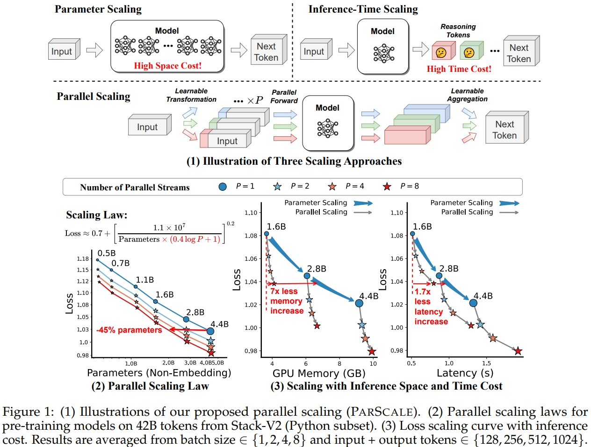
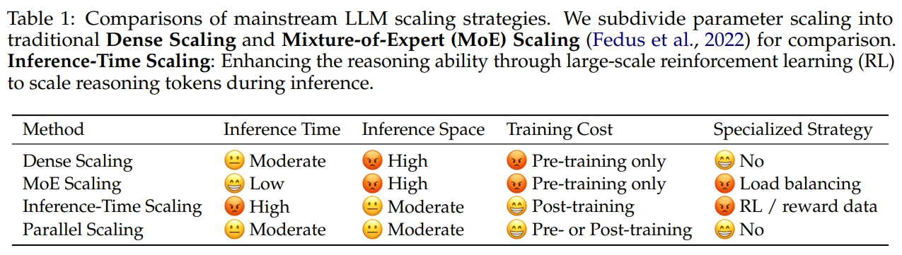
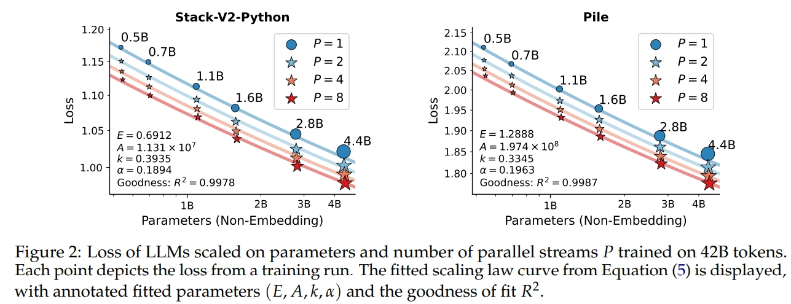
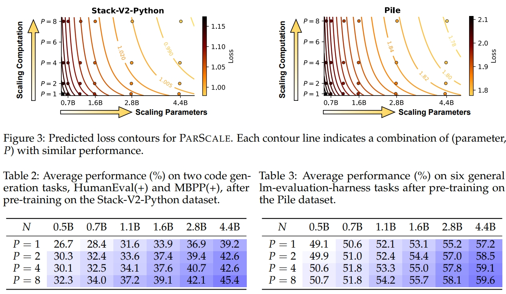
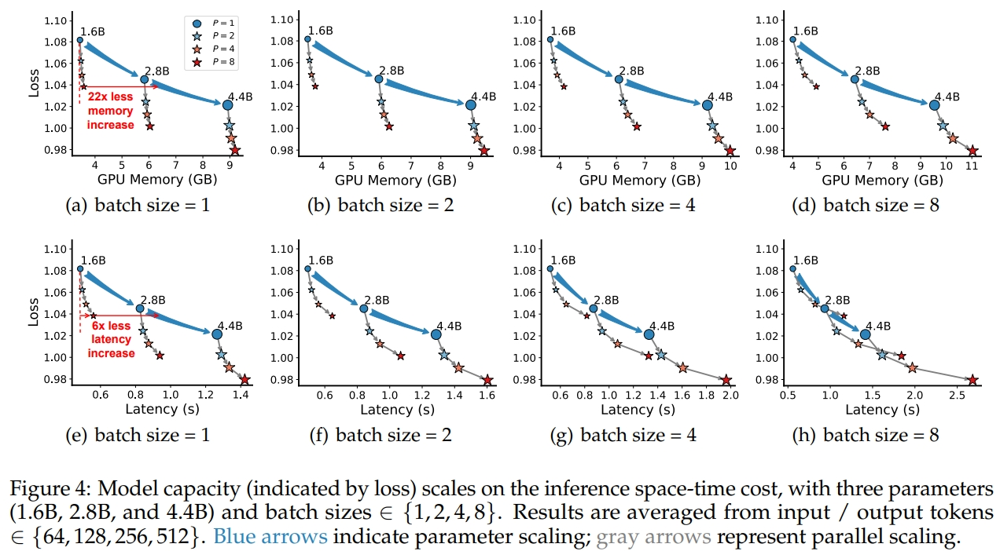

<div align="center">


# Parallel Scaling Law for Language Model


_Yet Another Scaling Law beyond Parameters and Inference Time Scaling_

[](https://arxiv.org/abs/2505.10475)
[](https://huggingface.co/ParScale)

<div align="center">

</div>


<p align="center">
    💡&nbsp;<a href="#-key-findings">Key Findings</a>
    | 📈&nbsp;<a href="#-scaling-law">Scaling Law</a>
    | ⚡&nbsp;<a href="#-cost-analysis">Cost Analysis</a>
    | 🔥&nbsp;<a href="#-models">Models</a>
    | 📚&nbsp;<a href="#-citation">Citation</a>
</p>
</div>

## 🌟 About

- Most believe that scaling language models requires a heavy cost in either **space** (parameter scaling) or **time** (inference-time scaling). 
- We introduce the *third* scaling paradigm for scaling LLMs: leverages **parallel computation** during both training and inference time (Parallel Scaling, or *ParScale*).
- We apply $P$ diverse and learnable transformations to the input, execute forward passes of the model in parallel, and dynamically aggregate the $P$ outputs. 
<div align="center">

</div>

---

## 💡 Key Findings
<div align="center">

</div>

Here are the core insights and benefits distilled from our theoretical analysis and empirical evaluations:

📈 **Logarithmic Scaling Law**: We theoretically and empirically establish that **scaling with $P$ parallel streams is comparable to scaling the number of parameters by** $O(\log P)$. This suggests that parallel computation can serve as an efficient substitute for parameter growth, especially for larger models.

✅ **Universal Applicability**: Unlike inference-time scaling which requires specialized data and limited application, it works with any model architecture, optimization method, data, or downstream task.


🧠 **Stronger Performance on Reasoning Tasks**: Reasoning-intensive tasks (e.g., coding or math) benefit more from ParScale, which suggests that scaling computation can effectively push the boundary of reasoning. 

⚡ **Superior Inference Efficiency**: ParScale can use up to **22x less memory increase** and **6x less latency increase** compared to parameter scaling that achieves the same performance improvement (batch size=1).

🧱 **Cost-Efficient Training via Two-Stage Strategy**: Training a parallel-scaled model doesn't require starting from scratch. With a two-stage training strategy, we can post-train ithe parallel components using only a small amount of data.

🔁 **Dynamic Adaptation at Inference Time**: We find that ParScale remains effective with frozen main parameters for different $P$. This illustrates the potential of dynamic parallel scaling: switching $P$ to dynamically adapt model capabilities during inference.

We release the inference code in `modeling_qwen2_parscale.py` and `configuration_qwen2_parscale.py`. Our 67 checkpoints is available at [🤗 HuggingFace](https://huggingface.co/ParScale).

---

## 📈 Scaling Law

- We carry out large-scale pre-training experiments on the Stack-V2 and Pile corpus, by ranging $P$ from 1 to 8 and model parameters from 500M to 4.4B. 
- We use the results to fit a new *parallel scaling law* that generalizes the Chinchilla scaling law.
- We release our parametric fitting code in `parametric_fit.py`.
- Feel free to try [🤗 HuggingFace Space](https://huggingface.co/spaces/ParScale/Parallel_Scaling_Law) for a nice visualization for the parallel scaling law!
<div align="center">


</div>

---

## ⚡ Cost Analysis

<div align="center">

</div>

- We further compare the inference efficiency between parallel scaling and parameter scaling at equivalent performance levels. 
- We release our analysis code in `cost_analysis.py`. Before using it, you should first install [llm-analysis](https://github.com/cli99/llm-analysis):

```bash
git clone https://github.com/cli99/llm-analysis.git
cd llm-analysis
pip install .
```

- You can use the following command to analyze the inference memory and latency cost for our 4.4B model, with $P=2$ and batch size=2:
```bash
python cost_analysis.py --hidden_size 2560 --intermediate_size 13824 --P 2 --batch_size 2
```

---

## 🔥 Models

✨ are our recommendation for strong models!

### Base models for scaling training data to 1T tokens

These models demonstrate strong competitiveness among existing small models, including SmolLM, gemma, and Llama-3.2.

|Model|Description|Download|
|:-:|:-:|:-:|
|ParScale-1.8B-P1|✨ Baseline $P=1$|[🤗 ParScale/ParScale-1.8B-P1](https://huggingface.co/ParScale/ParScale-1.8B-P1)|
|ParScale-1.8B-P2|✨ ParScale $P=2$|[🤗 ParScale/ParScale-1.8B-P2](https://huggingface.co/ParScale/ParScale-1.8B-P2)|
|ParScale-1.8B-P4|✨ ParScale $P=4$|[🤗 ParScale/ParScale-1.8B-P4](https://huggingface.co/ParScale/ParScale-1.8B-P4)|
|ParScale-1.8B-P8|✨ ParScale $P=8$|[🤗 ParScale/ParScale-1.8B-P8](https://huggingface.co/ParScale/ParScale-1.8B-P8)|

### Instruct models for scaling training data to 1T tokens

We post-trained the aforementioned base model on SmolTalk-1M to enable conversational capabilities.

|Model|Description|Download|
|:-:|:-:|:-:|
|ParScale-1.8B-P1-Inst|✨ Baseline $P=1$|[🤗 ParScale/ParScale-1.8B-P1-Inst](https://huggingface.co/ParScale/ParScale-1.8B-P1-Inst)|
|ParScale-1.8B-P2-Inst|✨ ParScale $P=2$|[🤗 ParScale/ParScale-1.8B-P2-Inst](https://huggingface.co/ParScale/ParScale-1.8B-P2-Inst)|
|ParScale-1.8B-P4-Inst|✨ ParScale $P=4$|[🤗 ParScale/ParScale-1.8B-P4-Inst](https://huggingface.co/ParScale/ParScale-1.8B-P4-Inst)|
|ParScale-1.8B-P8-Inst|✨ ParScale $P=8$|[🤗 ParScale/ParScale-1.8B-P8-Inst](https://huggingface.co/ParScale/ParScale-1.8B-P8-Inst)|


### Continual Pretraining Qwen-2.5-3B

We froze the parameters of Qwen-2.5-3B and only fine-tuned the newly introduced parameters on Stack-V2-Python. Since the following models share the same backbone parameters as Qwen-2.5-3B, they have the potential for dynamic ParScale: switching P to adapt model capabilities during inference.

|Model|Description|Download|
|:-:|:-:|:-:|
|ParScale-Qwen-3B-P2-Python|✨ ParScale $P=2$|[🤗 ParScale/ParScale-Qwen-3B-P2-Python](https://huggingface.co/ParScale/ParScale-Qwen-3B-P2-Python)|
|ParScale-Qwen-3B-P4-Python|✨ ParScale $P=4$|[🤗 ParScale/ParScale-Qwen-3B-P4-Python](https://huggingface.co/ParScale/ParScale-Qwen-3B-P4-Python)|
|ParScale-Qwen-3B-P8-Python|✨ ParScale $P=8$|[🤗 ParScale/ParScale-Qwen-3B-P8-Python](https://huggingface.co/ParScale/ParScale-Qwen-3B-P8-Python)|

- For full continual pretraining on Stack-V2-Python

|Model|Description|Download|
|:-:|:-:|:-:|
|ParScale-QwenInit-3B-P1-Python|Baseline $P=1$|[🤗 ParScale/ParScale-QwenInit-3B-P1-Python](https://huggingface.co/ParScale/ParScale-QwenInit-3B-P1-Python)|
|ParScale-QwenInit-3B-P2-Python|ParScale $P=2$|[🤗 ParScale/ParScale-QwenInit-3B-P2-Python](https://huggingface.co/ParScale/ParScale-QwenInit-3B-P2-Python)|
|ParScale-QwenInit-3B-P4-Python|ParScale $P=4$|[🤗 ParScale/ParScale-QwenInit-3B-P4-Python](https://huggingface.co/ParScale/ParScale-QwenInit-3B-P4-Python)|
|ParScale-QwenInit-3B-P8-Python|ParScale $P=8$|[🤗 ParScale/ParScale-QwenInit-3B-P8-Python](https://huggingface.co/ParScale/ParScale-QwenInit-3B-P8-Python)|

- For full continual pretraining on Pile

|Model|Description|Download|
|:-:|:-:|:-:|
|ParScale-QwenInit-3B-P1-Pile|Baseline $P=1$|[🤗 ParScale/ParScale-QwenInit-3B-P1-Pile](https://huggingface.co/ParScale/ParScale-QwenInit-3B-P1-Pile)|
|ParScale-QwenInit-3B-P2-Pile|ParScale $P=2$|[🤗 ParScale/ParScale-QwenInit-3B-P2-Pile](https://huggingface.co/ParScale/ParScale-QwenInit-3B-P2-Pile)|
|ParScale-QwenInit-3B-P4-Pile|ParScale $P=4$|[🤗 ParScale/ParScale-QwenInit-3B-P4-Pile](https://huggingface.co/ParScale/ParScale-QwenInit-3B-P4-Pile)|
|ParScale-QwenInit-3B-P8-Pile|ParScale $P=8$|[🤗 ParScale/ParScale-QwenInit-3B-P8-Pile](https://huggingface.co/ParScale/ParScale-QwenInit-3B-P8-Pile)|


### Checkpoints Used to Fit the Scaling Law

Download link: https://huggingface.co/ParScale/ParScale-{size}-{P}-{dataset}

- {size}: model size, from {0.7B, 0.9B, 1.3B, 1.8B, 3B, 4.7B}
- {P}: number of parallels, from {P1, P2, P4, P8}
- {dataset}: training dataset, from {Python, Pile}
- $6\times 4 \times 2=48$ checkpoints in total.

### Usage Example with 🤗 Hugging Face

```python
from transformers import AutoModelForCausalLM, AutoTokenizer
name = "ParScale/ParScale-1.8B-P8" # or anything else you like
model = AutoModelForCausalLM.from_pretrained(name, trust_remote_code=True).to("cuda")
tokenizer = AutoTokenizer.from_pretrained(name)
inputs = tokenizer.encode("Hello, how are you today?", return_tensors="pt").to("cuda")
outputs = model.generate(inputs, max_new_tokens=128)[0]
print(tokenizer.decode(outputs))
```


## 📚 Citation

```bibtex
@article{ParScale,
      title={Parallel Scaling Law for Language Models}, 
      author={Mouxiang Chen and Binyuan Hui and Zeyu Cui and Jiaxi Yang and Dayiheng Liu and Jianling Sun and Junyang Lin and Zhongxin Liu},
      year={2025},
      eprint={2505.10475},
      archivePrefix={arXiv},
      primaryClass={cs.LG},
      journal={arXiv preprint arXiv:2505.10475},
      url={https://arxiv.org/abs/2505.10475}, 
}
```
